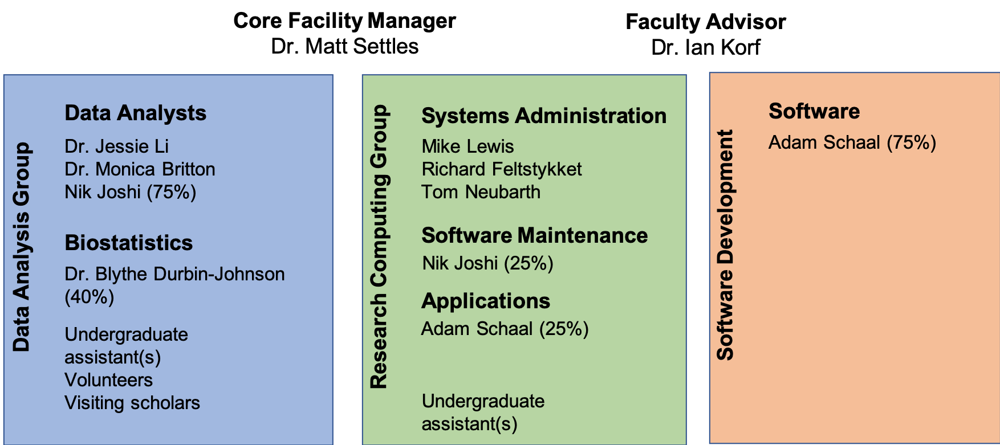

# Quick Introduction to the Workshop and Core

__The mission of the Bioinformatics Core facility in the UC Davis Genome Center is to facilitate outstanding omics-scale research through these activities:__

 

## Staff

 

## Contacts

* Bioinformatics related questions, include but not limited to bioinformatic methods questions, software use, data questions.
  * Bioinformatics.core@ucdavis.edu
* Computing Issues, include but not limited to user account questions, equipment failure/malfunction, software install, software failures (not related to use)
  * helpdesk@genomecenter.ucdavis.edu
* Training courses information
  * training.bioinformatics@ucdavis.edu

## Workshop Goals

* End to End understanding of microbial community analysis (amplicon analysis)
  * Discussions/lectures
  * Technologies
  * Experimental design
  * Cost estimation
  * Workflow
  * Microbial community analysis
* To work through a complete experiment, starting from raw data to completion, including making some figures.
* Goal is 30-40% lecture/discussion 60-70% hands-on

## Internet

You will need to access the ESALQ wireless via your laptop to participate in the hands-on exercises.

## Workshop Materials

Workshop materials are all posted on github, and publicly available:

http://bioinformatics.ucdavis.edu/training/events/

* Github main page:

https://github.com/ucdavis-bioinformatics-training

* This Microbial Community Analysis Workshop

  https://github.com/ucdavis-bioinformatics-training/2019_April_ESALQ_Microbial_Community_Analysis

  https://ucdavis-bioinformatics-training.github.io/2019_April_ESALQ_Microbial_Community_Analysis/

## Computing Cluster

Course will be conducted using the Bioinformatics Core's servers and compute cluster __tadpole.genomecenter.ucdavis.edu__

Everyone should get an account.  
https://computing.genomecenter.ucdavis.edu	 

Request an account -> sponsor "Bioinformatics Core Workshop"

If you already have an account on our systems, then please tell us your username.

Cluster usage will be under the slurm reservation  ‘workshop’

Reservation will last 1 full week.

**workshop       ACTIVE  2019-04-022  2019-04-28

<!-- Lunchs?
## Industry Sponsor Lunch and Learns

* [Lexogen](https://www.lexogen.com/)
* [Qiagen](https://www.qiagen.com/us/)
* [Illumina](https://www.illumina.com/)
* [10X * Genomics](https://www.10xgenomics.com/)
-->
